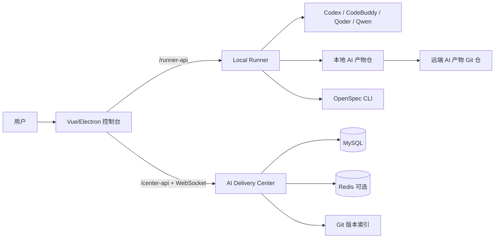

# AI Coding 需求交付工具链

`ai-coding` 是面向 OPP（展业平台）微服务项目的 AI 需求交付工具链。它把 PRD 分析、技术方案、OpenSpec 实施、单元测试、代码评审和交付复盘串成一条可视化、可追溯、可协作的交付链路。

当前系统已经从早期的本地技能集合，演进为“协作中心 + 本地 Runner + Web/Electron 控制台 + 多 Agent 技能”的完整平台。

## 系统全景



- **AI 需求交付控制台**：`tools/ai-delivery-console`，提供 Web 与 Electron 桌面端体验。
- **Local Runner**：控制台内置 Node 服务，负责本机 Git、OpenSpec、Agent CLI、技能同步和旧产物导入。
- **AI Delivery Center**：`tools/ai-delivery-center`，Spring Boot 协作中心，保存项目、需求、审核、Job、运行日志、实时事件、Git 版本索引等共享事实。
- **技能系统**：`skills/` 下维护源技能，Runner 启动和项目仓初始化时同步到 `.codex`、`.codebuddy`、`.qoder`、`.qwen`。
- **OpenSpec**：`openspec/` 提供结构化变更管理，沉淀 proposal、design、tasks、specs、验证报告和归档记录。

## 核心能力

### 1. 需求全流程工作台

控制台以需求号聚合所有 AI 交付产物，当前主流程为 5 个阶段：

| 阶段 | 目标 | 主要产物 |
| --- | --- | --- |
| PRD | 解析需求来源、补充澄清、生成结构化 PRD | `docs/{需求号}/prd/analysis.md` |
| 技术方案 | 生成/评审技术方案，支持答疑、批注和版本上下文 | `docs/{需求号}/technical-design/design_review.md` |
| 实施验证 | 创建或更新 OpenSpec 工件，执行实现、验证和单元测试 | `openspec/changes/req-{需求号}/`、`docs/{需求号}/junit/**` |
| 代码评审 | 支持分支增量评审、staged 暂存区预审和问题追踪 | `docs/{需求号}/code-review/**` 或 `docs/code_review/**` |
| 交付复盘 | 汇总证据、风险和经验，沉淀可复用项目记忆 | `docs/{需求号}/retrospective/**` |

缺陷单会跳过 PRD 阶段，直接从缺陷修复技术方案开始推进。

### 2. 可视化界面与协作体验

- 登录、项目列表、个人中心和可收起的项目导航。
- 需求看板支持类型、阶段、涉及工程筛选，展示在线人数、待审数量、Job 状态、Token 用量和 AI 代码保留度。
- 需求详情页支持阶段审核、打回实施、OpenSpec 子步骤推进、运行日志查看、产物刷新和 Git 同步。
- Markdown 产物预览支持左侧目录、Mermaid 渲染、缩放、护眼模式、下载、版本选择和版本 diff。
- 技术方案支持正文选区批注、批注回复线程、批注高亮定位、右侧批注栏、批注纳入下一次生成。
- 产物分享支持登录分享页和公开分享页；公开分享可按 token、过期、撤销、下载权限和批注展示权限控制。
- OpenSpec 工件生成支持“视觉上下文”显式选择，图片默认不进入 Agent 上下文，避免无关附件污染生成输入。

### 3. Remote-only 协作架构

控制台采用 Center + Runner 的 remote-only 架构：

- Center 是需求流程、审核、issue、Job、运行事件和 Git 版本索引的共享事实源。
- Runner 只负责当前用户本机能力：clone/pull/push、OpenSpec、Agent CLI、终端执行、bootstrap import。
- 浏览器入口统一走 `5178`，HTTP(S) 页面通过 `/runner-api/*` 访问 Runner，通过 `/center-api/*` 访问 Center HTTP 和 WebSocket，降低 CORS 与 Mixed Content 问题。
- Electron `file://` 场景保留对 Runner 和 Center 的直连兼容。

### 4. Git-backed 产物仓

项目创建时必须配置 AI 产物 Git 仓。新流程中，Git 仓是可审阅交付物的事实源，Center 只保存版本索引和元数据。

受控产物主要包括：

```text
docs/{需求号}/
docs/code_review/
openspec/changes/
openspec/specs/
.codex/skills/
.codebuddy/skills/
.qoder/skills/
.qwen/skills/
```

Runner 私有运行态不进入项目 Git 仓，例如 Prompt、脚本、终端 transcript、阶段命令日志、run event outbox 等，默认位于：

```text
<deliveryWorkspaceRoot>/.ai-delivery/runtime/**
```

### 5. 项目记忆与交付复盘

系统已经引入项目记忆闭环：

- 从技术方案批注、批注回复、技术方案答疑、PRD 澄清、代码评审、交付复盘等证据中提取候选经验。
- 支持经验库、待确认经验、召回记录、过期/废弃记录管理。
- 经验可按技术经验、业务规则、风险教训、团队偏好、技术假设分类，并限定适用工程和阶段。
- 交付复盘阶段用于生成复盘报告、证据清单、候选经验和记忆召回反馈。

## 技能体系

技能源文件统一维护在 `skills/` 目录，修改技能时只编辑源目录；Runner 会同步到各 Agent 目录。

| 技能 | 用途 |
| --- | --- |
| `coding-prd-analyzer` | 读取飞书文档、设计稿、本地图片/PDF 等来源，输出结构化 PRD 分析 |
| `coding-design` | 基于 PRD、OpenSpec 和工程上下文生成技术方案 |
| `coding-design-question` | 针对技术方案评审问题生成独立答疑文件 |
| `coding-defect-design` | 面向 DEFECT 缺陷单输出根因、影响范围、修复方案和回滚预案 |
| `coding-openspec-amend` | 在已有 OpenSpec 工件基础上做增量修订 |
| `coding-junit` | 根据 Git 变更生成 Java 单元测试和报告 |
| `coding-review` | 执行增量代码评审、多工程联合评审和 staged 暂存区预审 |
| `coding-retrospective` | 汇总交付证据，生成复盘报告和候选经验 |
| `coding-database-query` | 安全执行只读数据库查询，辅助技术方案设计 |

OpenSpec 技能位于各 Agent 目录，覆盖新建、继续、探索、快速推进、应用、验证、归档、批量归档和规格同步等变更工作流。

## 目录结构

```text
ai-coding/
├── skills/                       # Coding 系列技能源文件
├── tools/
│   ├── ai-delivery-console/      # Vue + Electron + Local Runner 控制台
│   └── ai-delivery-center/       # Spring Boot 协作中心服务
├── openspec/
│   ├── config.yaml               # OPP 项目上下文和 OpenSpec 产物规则
│   ├── changes/                  # 活跃变更
│   └── specs/                    # 主规格说明
├── docs/                         # 需求交付产物、报告和评审结果
├── .codex/                       # Codex 技能与 OpenSpec 命令
├── .codebuddy/                   # CodeBuddy 技能与命令
├── .qoder/                       # Qoder 技能与命令
└── .qwen/                        # Qwen 技能与命令
```

## 本地启动

### 1. 启动 Center

```bash
cd tools/ai-delivery-center
mvn spring-boot:run
```

默认地址：`http://127.0.0.1:8728`。

### 2. 启动 Runner 和前端

```bash
cd tools/ai-delivery-console
npm install
npm run server:dev
npm run dev
```

默认地址：

- 浏览器入口：`http://127.0.0.1:5178`
- Local Runner：`http://127.0.0.1:8718`
- Center：`http://127.0.0.1:8728`

常用脚本：

```bash
npm run dev:local
npm run dev:dev
npm run dev:prd
npm run server:dev:local
npm run server:dev:dev
npm run server:dev:prd
npm run desktop:dev
npm run desktop:build
npm run build
npm run test:unit
npm run lint
```

环境 profile 通过 `AI_DELIVERY_ENV=local|dev|prd` 或对应 npm script 选择。受控 env 文件为 `.env` 和 `.env.<profile>`，shell 显式变量优先级最高。

## 配置要点

- `VITE_AI_DELIVERY_CENTER_BASE_URL`：Center 代理上游和 Electron 直连地址。
- `VITE_AI_DELIVERY_RUNNER_BASE_URL`：Runner 代理上游和 Electron 直连地址，默认 `http://127.0.0.1:8718`。
- `AI_DELIVERY_WORKSPACE_ROOT`：Runner 使用的工具链工作区根目录，默认回到本仓库根目录。
- `CODEX_COMMAND`、`CODEBUDDY_COMMAND`、`QODER_COMMAND`、`QWEN_COMMAND`：覆盖默认 Agent Provider 命令。
- `AGENT_PROVIDERS_JSON` / `AGENT_PROVIDERS_PATH`：扩展自定义 Agent Provider。

个人中心中常维护两类本机配置：

- **交付工作区**：本机保存各项目 AI 产物仓的目录，以及 Git SSH 凭证。
- **工程目录**：当前项目可访问的本机工程父目录，用于 Agent 读取或修改业务工程。

## 产物约定

```text
docs/{需求号}/prd/analysis.md
docs/{需求号}/prd/files/**
docs/{需求号}/technical-design/design_review.md
docs/{需求号}/implementation/artifact-review/inputs/**
docs/{需求号}/junit/**
docs/{需求号}/code-review/**
docs/{需求号}/metrics/ai-code-completeness.*
docs/{需求号}/retrospective/**
docs/code_review/code_review_{分支名}/summary.md
openspec/changes/req-{需求号}/
```

历史运行日志、终端 transcript 和阶段命令日志属于 Runner runtime，不作为可审阅产物同步到项目 Git 仓。

## 质量与验证

```bash
cd tools/ai-delivery-console
npm run lint
npm run test:unit
npm run build

cd ../ai-delivery-center
mvn test
```

OpenSpec 变更可使用：

```bash
openspec list --json
openspec validate <change-name> --strict
```

## 相关文档

- [AI 需求交付控制台](tools/ai-delivery-console/README.md)
- [AI Delivery Center](tools/ai-delivery-center/README.md)
- [控制台核心链路时序图](docs/ai-delivery-console-sequence.md)
- [OpenSpec 配置](openspec/config.yaml)
- [截图说明](tools/ai-delivery-console/screenshots/README.md)
