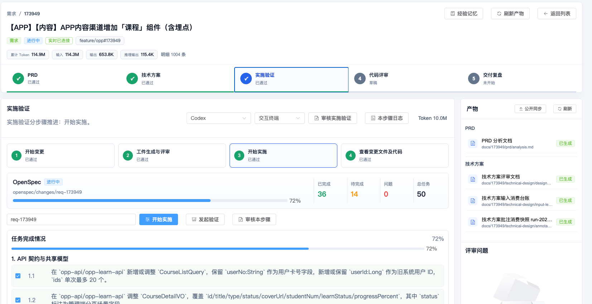

# 从个人 AI Coding 实践到 AI 需求交付平台的经验分享

# 背景：AI Coding 实践中的新问题

在过去一段时间里，我开始使用 **Codex \+ OpenSpec** 工具来辅助完成 SDD 开发过程。

一开始，我关注的是如何让 AI 帮我提升单点效率。比如需求来了以后，能不能让 AI 帮我分析 PRD？技术方案能不能让 AI 先出一版？代码实现完成后，能不能自动生成单元测试？代码评审能不能让 AI 先做一轮增量检查？

围绕这些场景，我逐步沉淀了一些 Skill：

- `coding-prd-analyzer`：需求分析 Skill，用来将 PRD、原型、设计稿整理成功能点清单。

- `coding-design`：技术方案设计 Skill，用来基于需求和工程上下文生成技术设计。

- `coding-junit`：单元测试 Skill，用来根据代码变更生成测试代码和报告。

- `coding-review`：代码评审 Skill，用来对分支变更进行增量评审。

- `coding-retrospective`：交付复盘助手Skill，读取 PRD 澄清、技术方案答疑、批注回复、实施验证、代码评审、历史记忆引用记录等证据，生成交付复盘报告、证据清单、候选经验

- OpenSpec 系列 Skill：用来管理 proposal、design、tasks、verification 等结构化变更产物。

这些 Skill 在个人使用阶段非常有效。它们把很多重复、繁琐、需要经验判断的工作，变成了相对标准化的 AI 辅助动作。

但随着 Skill 越来越多，我发现新的问题开始出现：

1. **每个 Skill 的标准输入是什么？标准输出是什么？**

2. **Skill 和 Skill 之间是否可以串联起来？**

3. **每个 Skill 都会产出一份规范产物，这些产物之间是否可以共享？**

4. **产物应该存储在哪里，后续如何检索和复用？**

5. **AI 生成的产物能不能支持多人评审、打回和闭环？**

6. **如何控制 token 成本，并把完整交付过程中的经验沉淀下来？**

也就是说，最开始的问题是“如何让 AI 帮我做事”，但到了后面，问题变成了：

**如何让多个 AI 能力稳定地组成一条可控、可追踪、可复用的工程交付流程。**

这就是 AI Coding 交付平台诞生的背景。

# 平台介绍：AI Coding 交付平台是什么

> AI Coding 交付平台，是一个围绕需求交付流程构建的本地研发工作台。它不是单个 AI Agent，也不是某一个 Skill 的可视化页面，而是把多个 AI Coding Skill、OpenSpec 工作流和交付产物组织起来，形成一条可视化、可审核、可追踪的需求交付流水线。
> 
> 

平台底层的逻辑可以概括为：

对应到实际交付过程，平台把一个需求拆成四个阶段（**第5阶段目前还在设计中**）：

**PRD 分析 → 技术方案设计 → 实施验证 → 代码评审→ 交付复盘**

每个阶段都有对应的 Skill 或 OpenSpec 流程，每个阶段都会产出标准化文件，每个产物都可以被查看、编辑、审核、打回和复用

因此，平台解决的不是“让 AI 生成一段内容”，而是让 AI 生成的内容进入一个稳定的工程交付流程。

# 流程拆解：每个步骤的功能与底层原理

### PRD 分析：把模糊输入转成结构化需求

PRD 阶段的核心功能，是通过 `coding-prd-analyzer` 对原始需求进行分析。

输入可以是飞书文档、产品描述、图片、PDF、原型链接，也可以是人工补充的澄清说明。

输出产物是：**docs/\{需求号\}/prd/analysis\.md**

[164946\_20260626155830\_PRD\_分析文档\.html](图片和附件/164946_20260626155830_PRD_分析文档.html)

这一阶段解决的是 **需求输入标准化**。

如果没有这一步，后续技术方案和代码实现很容易建立在模糊理解上。平台先把自然语言需求整理成结构化产物，让后续步骤有稳定输入。

### 技术方案设计：把需求转成工程蓝图

技术方案阶段的核心功能，是通过 `coding-design` 基于** PRD 产物**和**工程上下文**生成技术方案。

它的输入不是随口描述，而是上一阶段沉淀下来的 `analysis.md`，再加上需求号、涉及工程、补充材料、评审意见等上下文。

这一阶段要回答的问题是：

- 这个需求应该改哪些模块？

- 涉及哪些接口、表结构、缓存、消息、权限？

- 有没有兼容性风险？

- 有没有性能或并发问题？

- 实现方案是否符合项目规范？

- 哪些地方需要重点评审？

输出产物是：**docs/\{需求号\}/technical\-design/design\_review\.md**

[164946\_20260626160840\_技术方案评审文档\.html](图片和附件/164946_20260626160840_技术方案评审文档.html)

**多人怎么评审？**

这一阶段解决的是 **从产品语言到工程语言的转换**。

我比较看重这个产物，因为它相当于工程图纸。后续实施、单测、代码评审，都可以围绕这份设计方案展开，而不是直接从 PRD 跳到代码。

### 实施验证：用 OpenSpec 管理变更过程

实施验证阶段的核心不是简单让 AI 写代码，而是用 OpenSpec 把变更过程结构化。

这一阶段要回答的问题是：

- 这次变更的目标是什么？

- 哪些内容明确不做？

- 设计方案是否被拆成可执行任务？

- 任务是否完成？

- 本地代码实际改了哪些文件？

- 单测是否覆盖关键路径？

- 实施结果是否符合前面的技术方案？

这一阶段解决的是 **AI 实施过程可控**。

AI 写代码很快，但快不等于可靠。OpenSpec 的价值在于，它让 AI 实施不是一段自由发挥的对话，而是围绕 proposal、design、tasks 这些结构化工件推进。

平台在这里承担的角色，是把 OpenSpec 的工件、任务、执行日志、Git diff、单测报告统一展示出来，让实施过程可以被检查。

### 代码评审：把实现结果转成质量反馈

代码评审阶段的核心功能，是通过 `coding-review` 对分支变更做增量评审。

输入通常包括：

- 分支名

- Git diff

- 技术方案

- 外部约束文档

- 项目编码规范

这一阶段要回答的问题是：

- 代码是否符合技术方案？

- 有没有明显 bug？

- 有没有并发、事务、缓存、幂等、权限等风险？

- 有没有破坏原有逻辑？

- 有没有缺少必要测试？

- 哪些问题必须修复，哪些风险可以接受？

输出产物是：**docs/code\_review/code\_review\_\{分支名\}/summary\.md**

这一阶段解决的是 **质量反馈闭环**。

如果评审通过，需求可以进入收口；如果评审发现问题，平台会把问题回流到实施阶段，修复后重新验证、重新评审。

所以代码评审不是最后的一份报告，而是整个交付闭环的一部分。

### 交付复盘：把一次交付转成下一次交付的经验资产

交付复盘阶段的核心功能，是在需求完成后，对整个 AI Coding 交付过程进行总结和沉淀。

它的输入不是某一个单点产物，而是一次需求交付全过程中的数据：

- PRD 分析产物

- 技术方案产物

- OpenSpec 工件和任务完成情况

- 代码变更

- 单元测试报告

- 代码评审报告

- 审核意见和打回记录

- Agent 运行日志

这一阶段要回答的问题是：

- 交付结论：是否完成、是否仍有风险。

- 沟通脉络：澄清、答疑、批注、评审、打回如何影响方案和实现。

- 关键决策：哪些决策改变了技术路线或边界。

- 返工原因：哪些沟通或证据暴露了遗漏。

- 可沉淀经验：业务规则、技术经验、风险教训、团队偏好或待验证假设

输出产物是：**docs/\{需求号\}/retrospective/summary\.md**

# 平台如何解决这些痛点

> 前面提到，当 Skill 越来越多以后，问题已经不再是“某一个 Skill 能不能做好”，而是 **Skill 之间如何协同、产物如何流转、过程如何可控、经验如何沉淀**。
> 
> 

平台的价值，就是把这些原本靠个人经验手工维护的事情，变成可视化、标准化、可追踪的交付能力。

# 重新认识 AI Coding 的产物

**一句话：token是燃料、agent是发动机、产物的原材料，产物在AI coding承担非常重要的角色**

# 需求案例

# 未来展望

# 思考

1. 如何提升 AI Coding 质量，包括产物、代码等？

2. 如果未来平台包揽了整个devops的流程，程序员将充当什么角色？

**github地址：****https://github\.com/KeyLin\-Da/ai\-coding/tree/main/tools/ai\-delivery\-console**

