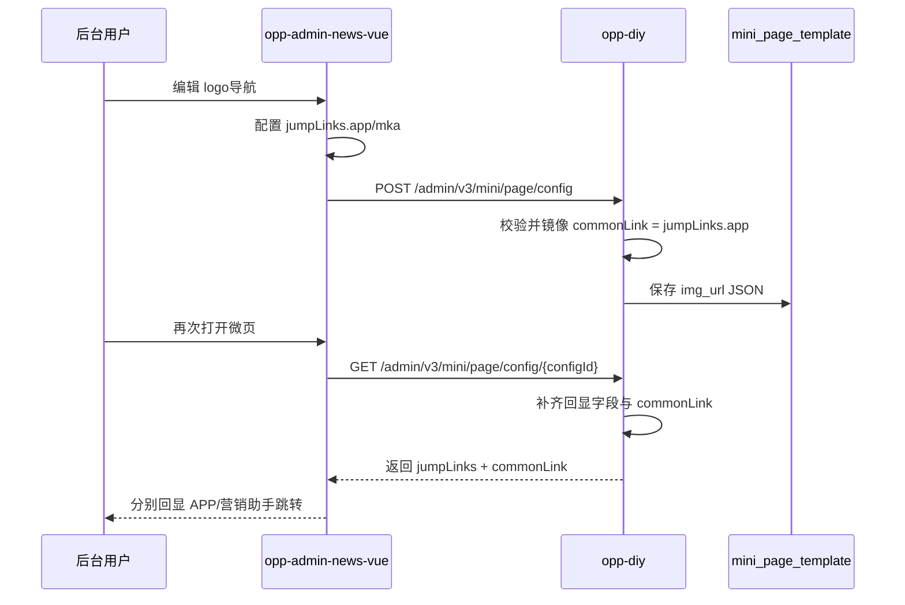

## Context

需求 166502 涉及 `opp-admin-news-vue` 旧版 Vue 2 管理后台和 `opp-diy` 微页装修服务。当前事业机会微页管理在 `topicAdminDir1/microManagement.vue` 中直接复制 `/packages/mixHome/pages/microPage/index?configId=<id>`；社群微页配置已有「复制路径」双路径弹窗，可作为前端交互参考。

`logo导航` 组件当前在 `components/micro/microEditor/components/attributeModules/navigation.vue` 中维护单一跳转配置，并通过 `commonLink` 兼容其它平台。后端 `MiniPageConfigServiceImpl#getLogTypeTemplateData` 会为 `navigation` 的 `img_url` JSON 补齐 `commonLink`，`MiniPageTemplateServiceImpl#processTemplateResponseList` 在内管回显时复用该逻辑。

## Goals / Non-Goals

**Goals:**

- 让事业机会微页管理复制入口展示 APP 与营销助手小程序两条路径。
- 让 `logo导航` 每个图片项支持 `jumpLinks.app` 与 `jumpLinks.mka` 双端配置，且两者均非必填。
- 迁移历史单跳转到 APP 跳转，并按 PRD 使用真实历史 UTM 字段拼接 APP 地址。
- 保留 `commonLink` 并使其镜像 APP 配置，继续支持其它平台读取。
- 为历史数据提供备份、校验和回滚脚本。

**Non-Goals:**

- 不改变微页发布、上下架、分类、主题绑定规则。
- 不移除 `commonLink`。
- 不改造非 PRD 范围内的其它组件跳转结构。

## Decisions

### 1. 以 `jumpLinks` 为新主结构，`commonLink` 为兼容镜像

`navigation.imgUrl[n]` 新增：

```json
{
  "jumpLinks": {
    "app": {
      "jumpType": 1,
      "appName": "极友料",
      "jumpUrl": "/packages/mixHome/pages/microPage/index?configId=123",
      "wxjAppOpenMethod": 1,
      "appId": "wx...",
      "originalAppId": "gh_..."
    },
    "mka": {
      "jumpType": 1,
      "appName": "营销助手",
      "jumpUrl": "/pages/groupOperation/microPage?configId=123",
      "wxjAppOpenMethod": 1,
      "appId": "wx...",
      "originalAppId": "gh_..."
    }
  },
  "commonLink": {
    "jumpType": 1,
    "appName": "极友料",
    "jumpUrl": "/packages/mixHome/pages/microPage/index?configId=123",
    "wxjAppOpenMethod": 1,
    "appId": "wx...",
    "originalAppId": "gh_..."
  }
}
```

原因：`jumpLinks` 表达双端能力，`commonLink` 保持历史消费方不变。备选方案是删除 `commonLink` 或让其指向营销助手配置，但会破坏现有平台兼容性。

### 2. 前端复用 `jump-link-model`，通过入参控制营销助手差异

APP 跳转入口打开现有弹窗并保留完整选项；营销助手入口传参过滤「极快测」，并传入隐藏「在无限极App中打开方式」的标志。过滤应为局部参数，不改变全局字典。

### 3. 后端兼容处理以 `navigation` JSON 为边界

`MiniPageConfigServiceImpl#getLogTypeTemplateData` 负责：

- 旧数据无 `jumpLinks` 时，根据旧字段/`commonLink` 生成 `jumpLinks.app`。
- 回显时同时补齐旧压平字段，便于现有 Vue 2 表单读取。
- 保存或缓存处理时维护 `commonLink = jumpLinks.app`。
- 不因单个导航项 JSON 异常导致整页失败，异常项保留原值并记录日志。

### 4. 历史迁移以 PRD 为准，不使用硬编码 UTM

迁移脚本从历史字段 `utm_medium`、`utm_term`、`utm_content` 或兼容拼写中读取真实值。仅当 APP `jumpUrl` 非空且 UTM 有值时追加 query 参数；已有 query 使用 `&`，否则使用 `?`。

### 5. 营销助手映射规则集中封装

历史 APP 配置生成 `jumpLinks.mka` 的规则：

- 外部小程序、外部 H5、内部小程序且应用为营销助手/商城/新平衡生活+：完整维持一致字段。
- 内部小程序且应用为极友料/极易学：仅匹配 PRD 映射表时替换为营销助手页面。
- 极友料/极易学但不匹配映射表：`jumpLinks.mka` 置空。

## Sequence



## API Contract

保存接口沿用现有：

```http
POST /admin/v3/mini/page/config
Content-Type: application/json
```

请求片段：

```json
{
  "templateList": [
    {
      "type": "navigation",
      "imgUrl": "[{\"url\":\"https://img.example/logo.png\",\"jumpLinks\":{\"app\":{\"jumpType\":1,\"appName\":\"极友料\",\"jumpUrl\":\"/packages/mixHome/pages/microPage/index?configId=123\",\"wxjAppOpenMethod\":1,\"appId\":\"wx-app\",\"originalAppId\":\"gh-app\"},\"mka\":{\"jumpType\":1,\"appName\":\"营销助手\",\"jumpUrl\":\"/pages/groupOperation/microPage?configId=123\",\"wxjAppOpenMethod\":1,\"appId\":\"wx-mka\",\"originalAppId\":\"gh-mka\"}},\"commonLink\":{\"jumpType\":1,\"appName\":\"极友料\",\"jumpUrl\":\"/packages/mixHome/pages/microPage/index?configId=123\",\"wxjAppOpenMethod\":1,\"appId\":\"wx-app\",\"originalAppId\":\"gh-app\"}}]"
    }
  ]
}
```

回显接口沿用现有：

```http
GET /admin/v3/mini/page/config/{configId}
```

响应中的 `navigation.imgUrl` MUST 保留 `jumpLinks` 与 `commonLink`。

## Migration Plan

1. 发布代码兼容旧数据：无 `jumpLinks` 时仍可回显旧 `commonLink`。
2. 创建 `mini_page_template` 备份表。
3. 仅迁移 `type = 'navigation'` 且 `img_url` 为合法 JSON 数组的数据。
4. 对每个数组项写入 `jumpLinks.app`、`jumpLinks.mka`，并保留/刷新 `commonLink`。
5. 按数组长度、迁移数量、抽样 jumpUrl、遗漏 `commonLink` 数据做校验。
6. 异常时用备份表按主键回滚 `img_url` 和 `updated_time`。

## Risks / Trade-offs

- [Risk] 历史 JSON 字段拼写不一致导致 UTM 丢失 → 兼容 `utm_medium`、`utmMedium`、`utm_midium` 等历史拼写并抽样验证。
- [Risk] `commonLink` 与 `jumpLinks.app` 不一致 → 保存、回显、迁移时统一以 APP 配置刷新 `commonLink`。
- [Risk] 营销助手映射误生成不可用地址 → 参数缺失或路径不匹配时置空 mka，不影响 app。
- [Risk] 复制路径弹窗与社群页面逻辑重复 → 优先复用现有交互模式，后续再评估抽组件。

## Open Questions

- 营销助手、商城、新平衡生活+ 在字典中的 `appName` 与 `appType` 具体枚举值需以运行环境字典为准。
- 迁移脚本执行环境和备份表命名需上线前由 DBA/运维确认。
