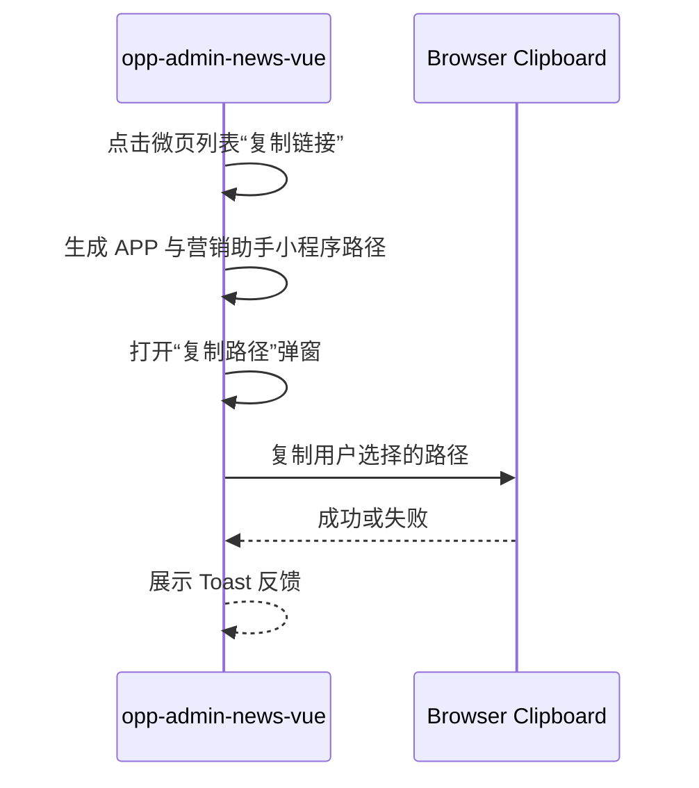
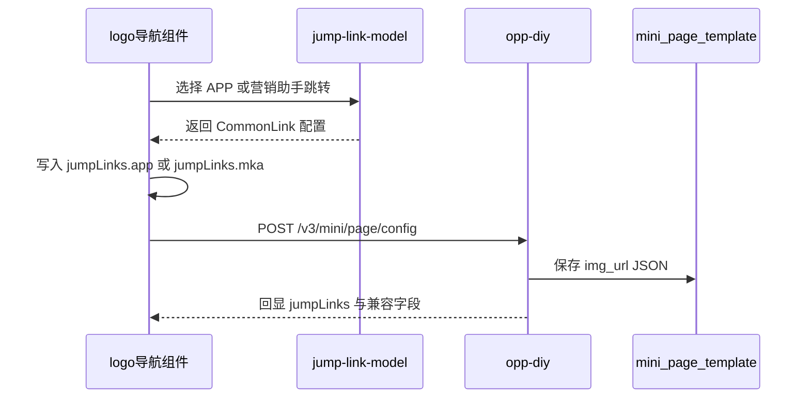

## Context

需求 166502 覆盖 `opp-admin-news-vue` 与 `opp-diy`。后台前端是 Vue 2 + Ant Design Vue，相关菜单包括事业机会-微页管理、素材分类-微页管理、社群-微页配置，以及微页编辑器的 logo 导航组件。接口工程 `opp-diy` 通过 `POST /v3/mini/page/config` 保存微页配置，`mini_page_template.img_url` 以 JSON 字符串保存组件图片与跳转配置。

当前事业机会、素材分类微页列表的 `copyLink` 直接复制 `/packages/mixHome/pages/microPage/index?configId={id}`。社群微页配置已有“复制路径”弹窗，展示 APP 与营销助手小程序两条路径，可作为 UI 模式复用。logo 导航组件当前只维护单个 `jumpUrl/commonLink`，并在前端校验中要求每个导航项必须填写跳转链接；这与 PRD 中“双端跳转均非必填”的要求冲突。

## Goals / Non-Goals

**Goals:**

- 统一三个微页管理入口的双端路径展示和复制体验。
- 支持 logo 导航组件分别配置 APP 与营销助手小程序跳转链接，并允许两端均为空。
- 保持 `opp-diy` 现有保存接口和表结构不变，通过 JSON 兼容扩展 `jumpLinks.app`、`jumpLinks.mka`。
- 为历史 logo 导航数据提供可验证、可回滚的迁移方案。

**Non-Goals:**

- 不改造 APP、营销助手小程序端路由实现。
- 不新增微页配置表字段，不调整 `mini_page_template` 表结构和索引。
- 不改变微页列表的查询、上下架、删除、复制任务 CODE 等无关行为。
- 不引入新的外部服务、Nacos 配置、RocketMQ 消息或分布式锁。

## Decisions

### 复制路径沿用前端本地生成

事业机会与素材分类列表新增与 `onlineOperation/micropageConfig.vue` 一致的“复制路径”弹窗。点击列表操作按钮时只记录 `copyConfigId` 并打开弹窗，不调用新接口。路径规则固定为：

| 端 | 路径 |
| --- | --- |
| APP | `/packages/mixHome/pages/microPage/index?configId={configId}` |
| 营销助手小程序 | `/pages/groupOperation/microPage?configId={configId}` |

备选方案是由后端返回路径。未采用，因为路径仅由配置 ID 和固定路由组成，新增接口会增加联调面，且社群微页配置已有前端生成模式。

### logo 导航使用 `jumpLinks` 承载双端配置

每个 logo 导航图片项新增：

```json
{
  "jumpLinks": {
    "app": {
      "jumpType": 1,
      "appName": "极友料",
      "appId": "xxx",
      "originalAppId": "xxx",
      "jumpUrl": "/packages/topic/pages/detail?id=1",
      "wxjAppOpenMethod": 1
    },
    "mka": {
      "jumpType": 1,
      "appName": "营销助手",
      "appId": "xxx",
      "originalAppId": "xxx",
      "jumpUrl": "/pages/material/topicDetail?id=1"
    }
  }
}
```

APP 配置继续同步到旧字段 `jumpUrl`、`jumpType`、`appName`、`appId`、`originalAppId`、`wxjAppOpenMethod` 和 `commonLink`，以兼容现有 `MiniPageConfigServiceImpl#getLogTypeTemplateData` 与小程序侧消费逻辑。营销助手配置只写入 `jumpLinks.mka`，不覆盖旧单端字段。

备选方案是把两端配置拆成平铺字段，如 `appJumpUrl`、`mkaJumpUrl`。未采用，因为现有跳转配置本身是对象，平铺会扩大兼容字段数量，并增加后端回显处理复杂度。

### 选择弹窗复用并按端控制能力

继续复用 `jump-link-model.vue`。APP 跳转入口按现有能力打开弹窗；营销助手小程序入口传入上下文参数，隐藏“在无限极App中打开方式”，并过滤“极快测”应用。弹窗提交后由 `navigation.vue` 按当前编辑的端写入 `jumpLinks.app` 或 `jumpLinks.mka`。

备选方案是复制一份营销助手专用弹窗。未采用，因为两端跳转方式、页面地址校验和字典加载逻辑高度一致，复用可降低维护成本。

### 前端校验改为仅校验图片必填

`microEditor/validate.js` 中 `navigation` 不再要求 `imgUrl.every(item => item.jumpUrl)`。样式一和样式二仍需保留图片素材校验，但跳转配置为空、仅 APP 为空或仅营销助手为空均可保存。

### 后端保持表结构不变并做 JSON 兼容

`POST /v3/mini/page/config` 的请求协议不变。`opp-diy` 保存阶段透传 `jumpLinks`；回显阶段在处理 `LOG` 类型模板时：

- 已有 `jumpLinks`：保留并补齐各端 `commonLink` 展示所需字段。
- 无 `jumpLinks` 但有旧 `commonLink/jumpUrl`：将旧配置作为 `jumpLinks.app` 返回给后台。
- JSON 解析异常：记录 templateId/configId 日志并保持原数据，不让单条异常阻断整页回显。

没有数据库 schema 改动，因此无新增字段类型、索引或分区策略。数据一致性仍依赖现有微页保存事务；缓存更新沿用 `updateMiniPageConfigCache` 和装修页缓存刷新链路。

### 历史迁移按已知路由生成营销助手配置

迁移脚本只处理 `type = navigation` 且 `img_url` 为合法 JSON 的记录。已有 `jumpLinks` 的图片项不覆盖。迁移步骤：

1. 备份 `mini_page_template` 到带日期后缀的备份表。
2. 将旧 `commonLink/jumpUrl` 复制为 `jumpLinks.app`。
3. 历史 UTM 字段存在时拼接到 APP `jumpUrl`，已有 query 用 `&`，否则用 `?`。
4. 按 APP 配置生成 `jumpLinks.mka`。

映射规则：

| APP 路径 | 营销助手路径 |
| --- | --- |
| `/packages/enjoy/pages/index/index?categoryId={id}` | `/pages/groupOperation/groupOperation?categoryId={id}` |
| `/packages/mixHome/pages/microPage/index?configId={id}` | `/pages/groupOperation/microPage?configId={id}` |
| `/packages/topic/pages/detail?id={id}` | `/pages/material/topicDetail?id={id}` |
| `/packages/topic/pages/playVideo?id={id}` | `/pages/material/videoDetail?id={id}` |
| `/packages/topic/pages/topicDetail?id={id}` | `/pages/material/materialDetail?id={id}` |

内部小程序且应用为极友料/极易学但路径不匹配映射表时，`jumpLinks.mka` 置空。外部小程序、外部 H5、营销助手/商城/新平衡生活+ 等无需转换的配置，营销助手配置默认与 APP 配置一致。

## API Contract

不新增接口。现有保存请求继续使用：

```http
POST /v3/mini/page/config
Content-Type: application/json
```

关键请求片段：

```json
{
  "templateList": [
    {
      "type": "navigation",
      "imgUrl": "[{\"url\":\"https://img\",\"jumpLinks\":{\"app\":{\"jumpType\":1,\"appName\":\"极友料\",\"jumpUrl\":\"/packages/topic/pages/detail?id=1\"},\"mka\":{\"jumpType\":1,\"appName\":\"营销助手\",\"jumpUrl\":\"/pages/material/topicDetail?id=1\"}}}]"
    }
  ]
}
```

后台详情回显必须返回同等 `jumpLinks` 结构；旧字段继续保留用于兼容。

## Flow





## Risks / Trade-offs

- [Risk] `copyLink(id, content)` 在事业机会页面还承担复制任务 CODE。 -> Mitigation: 新增路径弹窗方法时保留 `content` 分支或拆出 `copyTaskCode`，避免误改任务 CODE。
- [Risk] 旧 `commonLink` 与新 `jumpLinks.app` 不一致。 -> Mitigation: APP 端配置提交时始终同步旧字段；后端回显优先使用 `jumpLinks.app`，缺失时再从旧字段补齐。
- [Risk] 营销助手选择器误展示极快测或 APP 打开方式。 -> Mitigation: 为弹窗增加端类型参数并覆盖组件测试/手工验证。
- [Risk] 历史迁移脚本误覆盖已编辑新数据。 -> Mitigation: 仅处理缺失 `jumpLinks` 的项，迁移前备份，迁移后按 JSON_LENGTH 与缺失项查询校验。
- [Risk] 路径参数提取错误导致营销助手跳转不可用。 -> Mitigation: 使用结构化 URL/query 解析逻辑，覆盖五类映射和参数缺失场景。

## Migration Plan

1. 先部署兼容 `jumpLinks` 的后端回显逻辑，确保旧数据打开不报错。
2. 部署 `opp-admin-news-vue` 的复制路径弹窗、logo 导航双端配置和校验调整。
3. 在预发库执行迁移脚本，输出迁移总数、按数组长度分布、映射成功/置空数量和抽样结果。
4. 业务确认后在生产低峰期执行备份与迁移。
5. 发布后抽查三类微页入口、样式一/样式二 logo 导航、五类路径映射。

回滚策略：前端可回退上一版本；后端保留旧字段兼容；数据异常时从备份表按主键回滚 `img_url` 和 `updated_time`，并避免覆盖迁移后用户新编辑记录。

## Open Questions

- 历史 UTM 字段真实键名需在代码和库表中确认，可能存在 `utm_midium`、`utmMedium`、`utm_medium` 拼写差异。
- 营销助手配置“默认维持一致”是否包含 `originalAppId` 和 `wxjAppOpenMethod` 的完整复制，需要与产品/小程序端确认。
- 复制路径弹窗中的 APP 路径是否需要带 H5 hash 前缀，当前按现有代码与 PRD 路由使用小程序路径。
