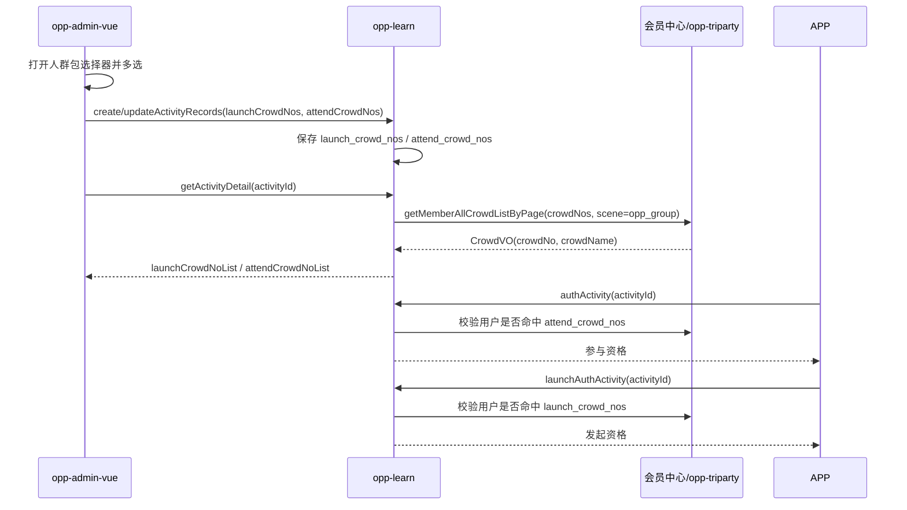

## 背景

需求 167023 将极易学学习活动的发起人和参与人权限从本地枚举迁移到会员中心人群包。后台菜单页面位于 `opp-admin-vue/src/views/learnManagement/activity`，列表页为 `list.vue`，新增/编辑/查看入口为 `detail.vue`，基础配置表单在 `components/ActivityBaseStep.vue`，表单模型、详情回填和提交转换在 `hooks/useCheckInLearningDetail.ts`。活动创建、编辑、详情和 APP 资格判断由 `opp-learn` 的 `/api/v2/activityInfo` 提供。

最新口径是：活动表仅保存人群包编码；后台编辑回显需要的名称由 `opp-learn` 活动详情接口统一返回；组队学习列表页不展示人群包列；APP 端通过 `/authActivity` 校验参与资格，通过 `/launchAuthActivity` 校验发起资格。

## 目标 / 非目标

**目标：**

- 在适用的极易学活动后台表单中，将发起人权限和参与人权限配置为多选人群包。
- 在 `fun_activity_info` 持久化 `launch_crowd_nos` 和 `attend_crowd_nos`，不存储名称快照。
- 在活动详情响应中返回 `launchCrowdNoList` 和 `attendCrowdNoList`，每项为 `CrowdDTO(code, name)`。
- `opp-learn` 通过 `MemberGroupBmoFeignClient#getMemberAllCrowdListByPage` 按 `crowdNos` 获取人群包名称。
- APP 发起资格和参与资格分别按发起人、参与人人群包配置判断，并保留员工直接通过。
- 保留历史活动兼容性和旧权限字段，不影响非适用范围的活动。

**非目标：**

- 不新增 `opp-learn` 后台人群包列表 API；后台选择器继续复用现有人群包能力。
- 不在组队学习列表页新增人群包列。
- 不在活动表中保存人群包名称。
- 不删除旧权限字段和旧权限判断逻辑。
- 不改造课程、考试、AI 练习或其他无关权限模型。

## 决策

### 数据模型仅保存编码

向 `fun_activity_info` 添加两个可空字段：

| 字段 | 用途 |
| --- | --- |
| `launch_crowd_nos` | 发起人人群包编码，逗号分隔；|
| `attend_crowd_nos` | 参与人人群包编码，逗号分隔；|

Java 字段使用 `launchCrowdNos` 和 `attendCrowdNos`。创建和更新接口通过现有 `FunCreateActivityForm extends FunActivityInfoVO` 与 `BeanUtil.copyProperties` 流转到实体，必要时补充显式赋值。

考虑的替代方案：保存名称快照。被拒绝，因为名称可能在会员中心变更，活动表只应保存稳定编码。

### 详情接口统一回显名称

活动详情响应新增：

```java
private List<CrowdDTO> launchCrowdNoList;
private List<CrowdDTO> attendCrowdNoList;

public class CrowdDTO {
    private String code;
    private String name;
}
```

`getActivityDetail` 从 `launchCrowdNos` / `attendCrowdNos` 解析编码，合并去重后调用：

```java
MemberGroupBmoFeignClient#getMemberAllCrowdListByPage(MemberCrowdListPageQuery)
```

请求设置 `crowdNos`、`scene = CrowdSceneEnum.OPP.getValue()`、`pageNo = 1`，`pageSize` 至少覆盖编码数量。返回的 `CrowdVO.crowdNo` 映射到 `CrowdDTO.code`，`CrowdVO.crowdName` 映射到 `CrowdDTO.name`。如果会员中心未返回某个编码，详情仍应保留该编码，名称可降级为编码或明确的失效占位，避免后台编辑丢失已保存配置。

考虑的替代方案：由 `opp-admin-vue` 在编辑页自行调用人群包接口解析名称。被拒绝，因为最新接口定义要求名称回显由活动详情统一返回。

### 后台选择器只负责选择和提交编码

`opp-admin-vue` 复用现有 `crowdPacksModal` 完成人群包分组、名称、编码、类型筛选和多选。表单保存时仅提交：

```json
{
  "launchCrowdNos": "CROWD001,CROWD002",
  "attendCrowdNos": "CROWD003"
}
```

编辑回显直接使用详情接口返回的 `launchCrowdNoList` / `attendCrowdNoList` 展示名称，并从 `code` 还原选中项。列表页 `opp-admin-vue/src/views/learnManagement/activity/list.vue` 保持现有列，不展示人群包信息。

前端实现锚点：

- `opp-admin-vue/src/views/learnManagement/activity/detail.vue`：继续承载三步编辑流程，并把基础配置子组件所需的人群包选择状态纳入表单提交链路。
- `opp-admin-vue/src/views/learnManagement/activity/components/ActivityBaseStep.vue`：在适用场景中用"选择投放对象"替换旧权限选择交互，复用 `src/components/crowdPacksModal/index.vue` 的多选能力；打卡学习只配置参与人人群包，组队学习同时配置参与人和发起人人群包。
- `opp-admin-vue/src/views/learnManagement/activity/hooks/useCheckInLearningDetail.ts`：扩展 `CheckInLearningFormModel`、详情归一化和 `buildCheckInLearningSubmitPayload`，负责 `CrowdDTO(code, name)` 与弹窗行数据之间的转换，以及 `launchCrowdNos` / `attendCrowdNos` 逗号分隔编码输出。
- `opp-admin-vue/src/api/learnActivity.ts`：补充活动详情和保存 payload 的人群包字段类型。
- `opp-admin-vue/src/views/learnManagement/activity/list.vue`：保持现有列表列，不新增发起人或参与人人群包列。

### APP 资格接口分开校验

APP 端继续调用现有接口：

| 接口 | 用途 | 人群包字段 |
| --- | --- | --- |
| `POST /api/v2/activityInfo/authActivity` | 参加活动资格 | `attend_crowd_nos` |
| `POST /api/v2/activityInfo/launchAuthActivity` | 发起活动资格 | `launch_crowd_nos` |

权限判断顺序：

1. 非适用范围活动继续走旧权限逻辑。
2. 员工用户直接通过。
3. 对应人群包字段为空时，按默认开放策略通过。
4. 登录非员工用户调用会员中心人群命中接口，命中任一配置编码即通过。
5. 会员中心调用失败时失败关闭，并记录清晰日志或返回明确失败消息。

组队学习现有逻辑中存在“创建队伍时取参与权限”的处理，新人群包逻辑不得沿用该覆盖关系：发起资格必须使用 `launch_crowd_nos`，参与资格必须使用 `attend_crowd_nos`。

### 流程



## 风险 / 权衡

- [风险] 后台前端误落到旧 `views/markLearn` 路径或已不存在的 `teamLearn.vue`。 -> 缓解：任务中明确真实菜单目录为 `learnManagement/activity`，并按 `detail.vue`、`ActivityBaseStep.vue`、`useCheckInLearningDetail.ts`、`learnActivity.ts` 拆分。
- [风险] 后台列表页被误加人群包列。 -> 缓解：PRD 已澄清列表页无变更，任务中明确不改 `learnManagement/activity/list.vue` 表格列。
- [风险] 人群包名称查询失败导致编辑页无法回显。 -> 缓解：详情接口保留编码并提供名称降级，前端不因名称缺失清空编码。
- [风险] `authActivity` 和 `launchAuthActivity` 误用同一个字段。 -> 缓解：封装按权限类型选择字段的助手方法，并覆盖单元测试。
- [风险] 非极易学或历史活动被切到新人群包逻辑。 -> 缓解：后端入口先判断适用范围；字段为空时保持兼容开放或旧权限行为。
- [风险] 会员中心命中接口失败影响真实用户。 -> 缓解：失败关闭并记录 activityId、用户编码、人群包编码和异常信息，便于排查。

## 迁移计划

1. 添加 `launch_crowd_nos` 和 `attend_crowd_nos` 可空列，先部署兼容字段。
2. 更新实体、VO、详情 DTO 和 mapper 投影，使旧数据在字段为空时继续可用。
3. 部署详情名称回显和 APP 权限判断逻辑。
4. 部署 `learnManagement/activity` 后台表单人群包选择与保存。
5. 按业务确认的新旧权限映射迁移历史活动。

回滚：保留旧权限字段和旧逻辑。如果新人群包配置出现问题，可隐藏后台新控件，并让未配置人群包的活动继续按兼容策略运行。

## 待解决问题

- 历史“指定市场、分公司、职称、白名单、指定行政员工、专卖店店员”的权威人群包编码是否已全部由会员中心提供。
- 会员中心对普通会员、持卡人和员工的人群命中入参是否统一使用 `userNo/dealerNo`，还是需要按用户类型区分。
