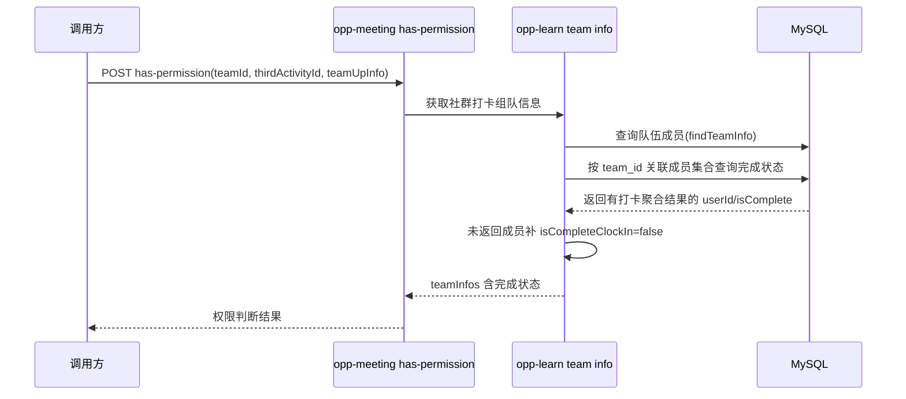
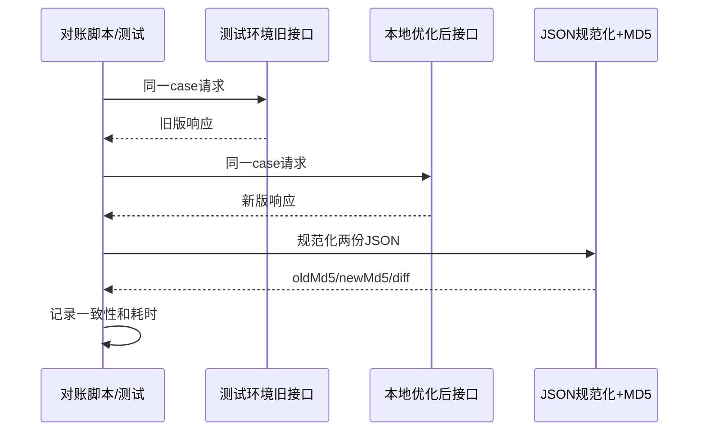

## Context

`/meeting/api/v1/activity-director/team-inspire/has-permission` 的权限判断依赖社群打卡组队信息，其中 `opp-learn` 会补充队伍成员的 `isCompleteClockIn` 状态。当前实现先通过 `funTeamDetailMapper.findTeamInfo(teamId, false)` 查询团队成员，再在 `getClockInCompleteStatus` 中提取所有 `userId`，传给 `FunActivityCalendarMapper.getIsCompleteClockIn` 形成大 `fad.user_id IN (...)`。

慢 SQL 的执行计划显示 `fun_activity_calendar` 先命中 7 个活动日，再通过 `calendarId_index` 回查 `fun_activity_data`，之后再过滤 `team_id` 和大批 `user_id`，聚合成本高。现有技术栈为 Spring Boot + MyBatis-Plus，复杂 SQL 通过 XML Mapper 承载，本次优化应沿用该模式。

API 契约保持不变：

```http
POST /meeting/api/v1/activity-director/team-inspire/has-permission?teamId=2026032916117105&thirdActivityId=2025050822000306
Content-Type: application/json
```

```json
{
  "teamId": 2026032916117105,
  "activityId": 2025050822000306,
  "teamInfos": [
    {
      "userNo": "C123456",
      "teamIdentity": 2,
      "isCompleteClockIn": true
    }
  ]
}
```

```json
{
  "hasPermission": true,
  "hasOpenInspire": false,
  "hasOpenInspireEnd": false,
  "inspireReMainNum": 1
}
```

## Goals / Non-Goals

**Goals:**

- 消除或显著减少 `getIsCompleteClockIn` 中的大 `user_id IN (...)`。
- 保持原有成员口径：`fun_team_detail.is_deleted = 0`、`team_id` 匹配，并与 `findTeamInfo` 一样要求成员存在于 `base_member`。
- 保持原有完成判定：限定 `fac.is_deleted = 0`、`fac.activity_id`、`fac.activity_day`、`fad.is_deleted = 0`、`fad.team_id`，按 `COUNT(fad.id) == differNumDays` 返回完成状态。
- 通过索引与执行计划验证性能收益。

**Non-Goals:**

- 不改变 Feign/API 入参、出参。
- 不改变权限规则、活动日计算规则或重复打卡计数语义。
- 不新增缓存、汇总表或异步计算链路。

## Decisions

### Decision 1: 用团队成员集合 JOIN 替代大 IN

将 `fad.user_id IN (Java 展开的成员列表)` 改为与团队成员派生表关联：

```sql
SELECT
  fad.user_id AS userId,
  CASE COUNT(fad.id)
    WHEN #{differNumDays} THEN 1
    ELSE 0
  END AS isComplete
FROM fun_activity_data fad
INNER JOIN (
  SELECT DISTINCT ftd.team_member AS user_id
  FROM fun_team_detail ftd
  INNER JOIN base_member bm ON bm.id = ftd.team_member
  WHERE ftd.team_id = #{teamId}
    AND ftd.is_deleted = 0
) members ON members.user_id = fad.user_id
INNER JOIN fun_activity_calendar fac ON fac.id = fad.calendar_id
WHERE fad.is_deleted = 0
  AND fad.team_id = #{teamId}
  AND fac.is_deleted = 0
  AND fac.activity_id = #{activityId}
  AND fac.activity_day IN (...)
GROUP BY fad.user_id;
```

理由：当前唯一调用点本身就是从 `findTeamInfo(teamId, false)` 得到全量团队成员后再展开 `userId`，数据库可以用同一口径直接圈定成员。该写法保留 Mapper “只返回有打卡聚合结果的用户”的行为，未返回用户仍由现有 Java 逻辑补 `false`。

备选方案：应用层分批 `IN`。它改动小，但仍保留长 SQL 和多次查询问题，作为回退策略。

### Decision 2: 暂不修改 `COUNT(fad.id)` 判定语义

虽然 `COUNT(DISTINCT fac.activity_day)` 可避免重复打卡影响，但这会改变现有规则。本次仅做性能优化，不调整业务语义。

### Decision 3: 增加联合索引

建议数据库补充索引：

```sql
CREATE INDEX idx_ftd_team_deleted_member
ON fun_team_detail(team_id, is_deleted, team_member);

CREATE INDEX idx_fad_team_user_deleted_calendar
ON fun_activity_data(team_id, user_id, is_deleted, calendar_id);

CREATE INDEX idx_fac_activity_deleted_day_id
ON fun_activity_calendar(activity_id, is_deleted, activity_day, id);
```

这些索引用于支撑成员集合、打卡数据和活动日历的过滤与关联。上线前需结合生产已有索引评估重复索引与写入成本。

### Decision 4: 用接口级 MD5 对账验证返参一致性

除 Mapper/SQL 层验证外，增加接口级回归对账：使用同一批 `teamId`、`thirdActivityId` 和请求体分别调用测试环境旧逻辑接口与本地优化后接口，将响应 JSON 规范化后计算 MD5 并对比。

规范化规则：

- 递归按字段名排序 JSON object key。
- 移除非业务动态字段，如 `traceId`、`requestId`、`timestamp`、`cost`、`serverTime`。
- 对业务数组保持接口原始顺序；如果某个数组业务上无序，需显式按稳定字段排序后再计算 MD5。
- MD5 不一致时输出结构化 diff，而不是只输出 hash 差异。

理由：单元测试能覆盖边界数据，但接口级对账能验证真实调用链、序列化结果和权限聚合结果是否保持一致。MD5 仅作为快速判定手段，失败时必须结合 diff 定位字段差异。

备选方案：人工抽样比对响应。该方式容易漏字段且不可重复，不作为主要验收方式。

## Flow





## Risks / Trade-offs

- [Risk] 派生表成员口径与 `findTeamInfo` 不一致 → Mitigation：SQL 中同步 `team_id`、`is_deleted`、`base_member` 关联条件，并通过回归用例比较优化前后成员完成状态。
- [Risk] 优化器仍选择从 `fac` 驱动并回查大量 `fad` → Mitigation：验证 `EXPLAIN`，必要时调整索引顺序或使用分批 `IN` 回退。
- [Risk] 新索引增加写入维护成本 → Mitigation：仅添加查询必要的联合索引，上线前核对已有索引并避免重复。
- [Risk] MD5 受字段顺序或动态字段影响产生误报 → Mitigation：先做 JSON 规范化，忽略明确的非业务动态字段，并在 MD5 不一致时输出 diff。
- [Risk] 本地环境与测试环境数据源不一致导致对账失败 → Mitigation：对账前确认本地连接同一测试数据源，或使用可复现的同源测试数据集。

## Migration Plan

1. 修改 Mapper SQL 与方法签名，移除 `userIds` 参数依赖。
2. 新增或确认必要联合索引。
3. 使用相同 `teamId/activityId/activityDays` 对比优化前后返回结果。
4. 使用本地优化后接口与测试环境旧接口执行 JSON 规范化 MD5 对账。
5. 使用 `EXPLAIN` 和压测数据验证 P95 下降目标。
6. 如执行计划不稳定或接口对账不一致，回退为旧 SQL 或分批 `IN` 策略。

## Open Questions

- 生产库是否已存在等价联合索引，需要 DBA 确认后决定是否新增。
- 是否存在隐藏调用场景要求只检查传入的用户子集；当前代码检索显示该方法只服务当前团队成员列表。
