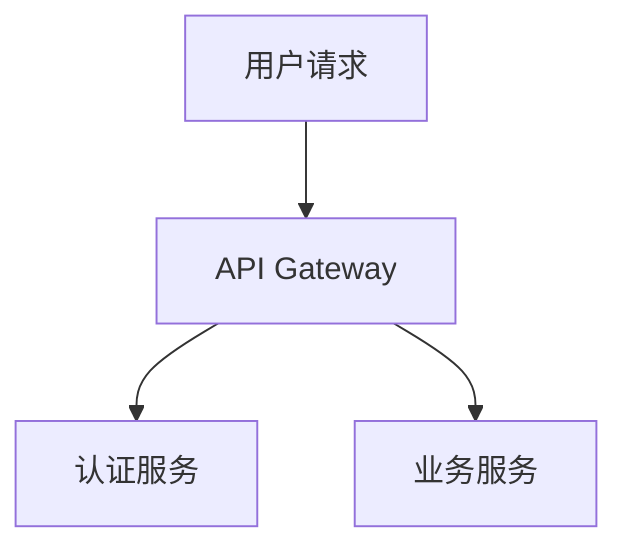

# Mermaid 图表渲染功能

## 问题描述
在 AI Delivery Console 中预览 Markdown 文档时，mermaid 图表无法正确渲染显示。

## 解决方案

### 1. 安装依赖
已安装以下依赖包：
- `mermaid`: Mermaid 核心库（v11.15.0）
- `markdown-it-mermaid`: Markdown-it 的 Mermaid 插件（v0.2.5）

### 2. 代码修改

#### MarkdownEditor.vue
在 [MarkdownEditor.vue](file:///Users/key.lin/work/Projects/ai-coding/tools/ai-delivery-console/src/components/MarkdownEditor.vue) 中进行了以下修改：

1. **导入 mermaid 相关模块**
   ```typescript
   import markdownItMermaid from 'markdown-it-mermaid';
   import mermaid from 'mermaid';
   ```

2. **初始化 mermaid**
   ```typescript
   mermaid.initialize({ 
     startOnLoad: false,
     theme: 'default',
     securityLevel: 'loose'
   });
   ```

3. **注册 markdown-it 插件**
   ```typescript
   md.use(markdownItMermaid);
   ```

4. **添加 DOM 更新后的渲染逻辑**
   ```typescript
   watch(previewHtml, async () => {
     await nextTick();
     try {
       await mermaid.run();
     } catch (error) {
       console.error('Mermaid rendering error:', error);
     }
   });
   ```

5. **添加样式支持**
   ```css
   .markdown-preview :deep(.mermaid) {
     text-align: center;
     margin: 20px 0;
     padding: 16px;
     background: #ffffff;
     border-radius: 6px;
     border: 1px solid #e3e8f2;
   }
   
   .markdown-preview :deep(.mermaid svg) {
     max-width: 100%;
     height: auto;
   }
   ```

#### env.d.ts
添加了 TypeScript 类型声明：
```typescript
declare module 'markdown-it-mermaid' {
  import type { PluginSimple } from 'markdown-it';
  const plugin: PluginSimple;
  export default plugin;
}
```

### 3. 支持的图表类型

现在支持以下 Mermaid 图表类型：

- **流程图** (graph/flowchart)
  ```mermaid
  graph TD
      A[开始] --> B[处理]
      B --> C[结束]
  ```

- **时序图** (sequenceDiagram)
  ```mermaid
  sequenceDiagram
      Alice->>Bob: Hello
      Bob-->>Alice: Hi
  ```

- **类图** (classDiagram)
  ```mermaid
  classDiagram
      Animal <|-- Duck
      Animal <|-- Fish
  ```

- **状态图** (stateDiagram)
- **甘特图** (gantt)
- **饼图** (pie)
- **用户旅程图** (journey)
- **需求图** (requirementDiagram)
- **Git 图** (gitGraph)

### 4. 测试验证

创建了单元测试文件 [mermaid-render.test.ts](file:///Users/key.lin/work/Projects/ai-coding/tools/ai-delivery-console/tests/components/mermaid-render.test.ts)，包含以下测试用例：

✅ 将 mermaid 代码块转换为 div 容器
✅ 保留普通代码块不变
✅ 支持流程图语法
✅ 支持时序图语法
✅ 支持类图语法

所有测试均已通过。

### 5. 使用方法

在 Markdown 编辑器中使用 mermaid 图表，只需使用标准的代码块语法：

```markdown
## 系统架构图



预览区域会自动渲染为可视化的图表。

## 注意事项

1. Mermaid 图表会在 Markdown 内容更新后自动重新渲染
2. 图表会以 SVG 格式渲染，支持缩放和响应式布局
3. 如果 mermaid 语法有误，会在浏览器控制台输出错误信息
4. 全屏预览模式下图表也会正常显示

## 相关文件

- [package.json](file:///Users/key.lin/work/Projects/ai-coding/tools/ai-delivery-console/package.json) - 依赖配置
- [MarkdownEditor.vue](file:///Users/key.lin/work/Projects/ai-coding/tools/ai-delivery-console/src/components/MarkdownEditor.vue) - 主要实现
- [env.d.ts](file:///Users/key.lin/work/Projects/ai-coding/tools/ai-delivery-console/src/env.d.ts) - TypeScript 类型声明
- [mermaid-render.test.ts](file:///Users/key.lin/work/Projects/ai-coding/tools/ai-delivery-console/tests/components/mermaid-render.test.ts) - 单元测试
- [design_review.md](file:///Users/key.lin/work/Projects/ai-coding/tools/ai-delivery-console/tests/fixtures/complete-workflow/docs/172014/technical-design/design_review.md) - 测试示例
