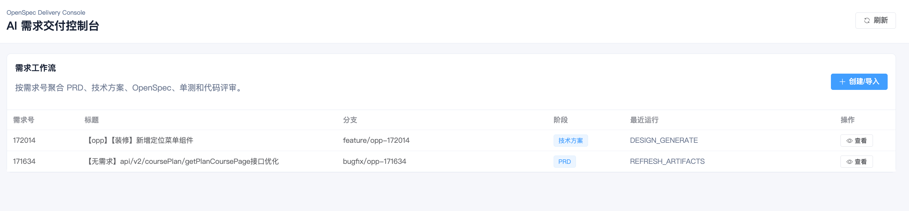
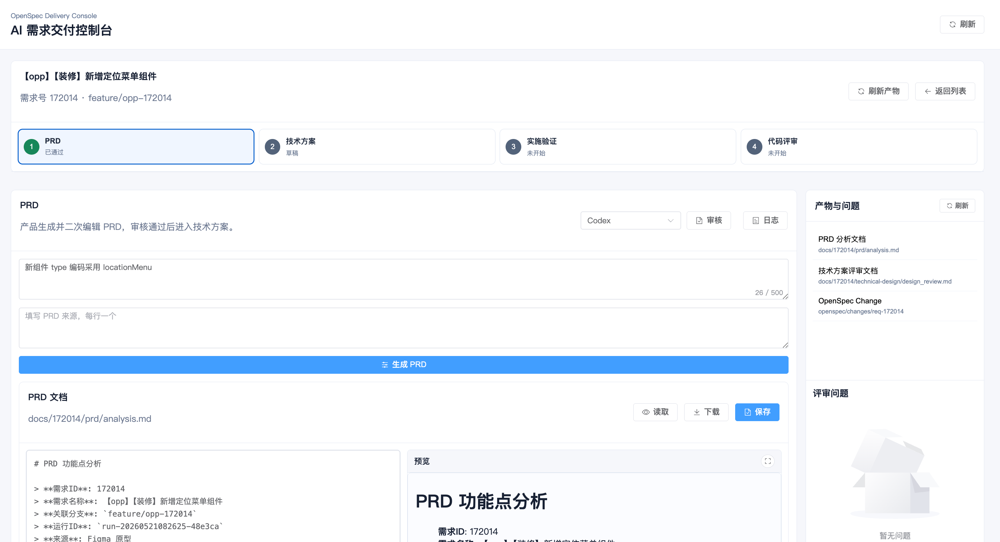
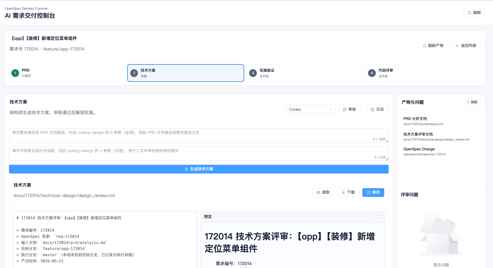
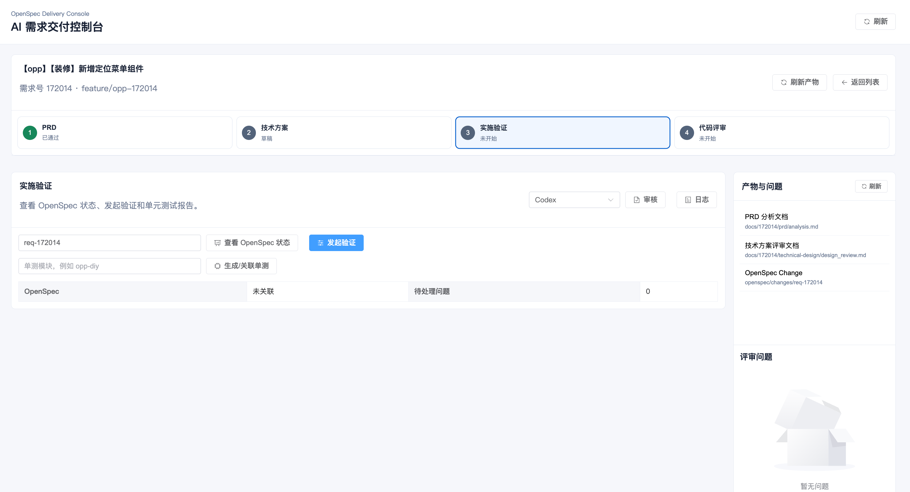
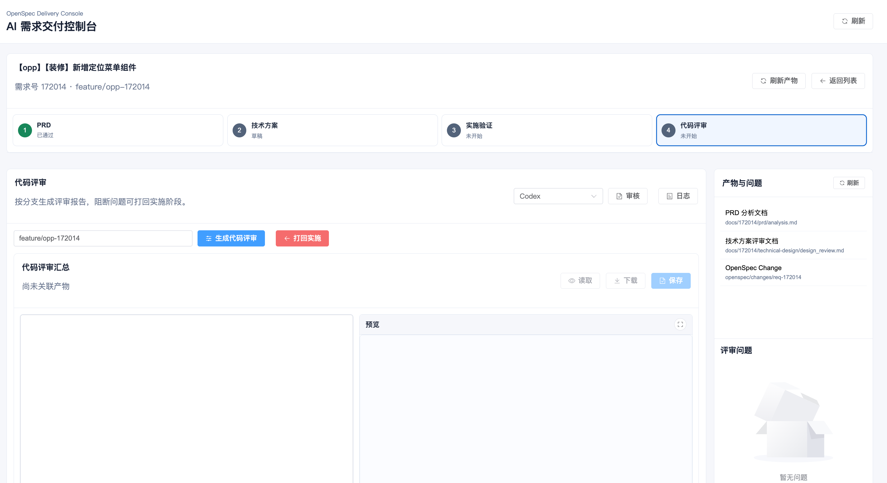

# AI 需求交付控制台

**OpenSpec + 自定义技能可视化交付台**

面向本地工作区的可视化工具，用于按需求号聚合 PRD、技术方案、OpenSpec 实施验证、单元测试报告和代码评审报告。让 AI 辅助编程的整个流程清晰可见、可控可追溯。

## ✨ 核心优势

- 🎯 **一站式管理**：一个界面掌控从需求到代码的全链路交付
- 📊 **可视化工作流**：直观展示每个阶段的进度和状态
- 🔄 **实时反馈**：SSE 技术实时展示 Agent 执行日志
- 🔒 **安全可靠**：工作区路径限制、锁文件机制、hash 校验三重保障
- ⚡ **灵活集成**：支持 Codex CLI 自动化或手动模式
- 📈 **产物聚合**：自动索引所有相关文档和报告

## 🚀 快速启动

**新手？** 先阅读 [5 分钟快速入门指南](QUICK_START.md)！

```bash
cd tools/ai-delivery-console
npm install
npm run server:dev
npm run dev
```

默认 Runner 地址为 `http://127.0.0.1:8718`，前端开发服务为 `http://127.0.0.1:5178`。如果需要指定工作区根目录：

```bash
AI_DELIVERY_WORKSPACE_ROOT=/Users/key.lin/work/Projects/ai-coding npm run server:dev
```

## 📸 界面展示

### 需求列表 - 全局掌控工作流进度



> 💡 **提示**：截图待补充。请按照 [screenshots/README.md](screenshots/README.md) 中的指南准备截图。

---

### PRD 分析 - 智能生成产品需求文档



> 💡 **提示**：截图待补充。展示 Markdown 实时预览和 Agent Provider 选择器。

---

### 技术方案 - 结构化设计输出



> 💡 **提示**：截图待补充。突出数据库查询和 Mermaid 图表渲染功能。

---

### 实施验证 - OpenSpec + 单元测试双重保障



> 💡 **提示**：截图待补充。显示任务完成度和测试报告统计。

---

### 代码评审 - 自动化质量把关



> 💡 **提示**：截图待补充。展示问题分类和严重程度标识。

---

## 🎯 使用场景

### 场景 1：从需求到代码的全流程管理

**适用人群：** Tech Lead、项目经理、全栈开发者

**工作流：**
1. 在需求列表页面创建新需求（例如 `172014`）
2. 进入 PRD 分析阶段，点击「生成 PRD」或手动执行 `/coding-prd-analyzer`
3. 切换到技术方案阶段，查询数据库结构并设计技术方案
4. 通过 OpenSpec 进行实施验证，运行单元测试确保质量
5. 最后进行代码评审，生成分级问题报告

**价值点：**
- ✅ 全流程可视化，无需在不同工具间切换
- ✅ 每个阶段的产物自动索引，便于追溯
- ✅ 实时日志输出，随时掌握 Agent 执行状态

---

### 场景 2：团队协作与代码审查

**适用人群：** 架构师、代码审查员、QA 工程师

**工作流：**
1. 查看团队成员的需求进度和状态
2. 对技术方案进行二次评审，输入评审意见
3. 触发增量代码评审，对比分支差异
4. 核对外部文档约束（如 API 规范、安全要求）
5. 导出评审报告，作为合并请求的附件

**价值点：**
- ✅ 统一的评审标准和问题分类
- ✅ 支持多工程联合评审
- ✅ 评审结果可追溯、可量化

---

### 场景 3：遗留系统的自动化测试补充

**适用人群：** 测试工程师、维护开发人员

**工作流：**
1. 选择需要补充测试的需求或模块
2. 执行 `coding-junit` 技能自动生成单元测试
3. 查看测试覆盖率和通过率统计
4. 根据测试报告调整代码逻辑
5. 重新运行验证，确保测试通过

**价值点：**
- ✅ 快速提升测试覆盖率
- ✅ 标准化测试报告格式
- ✅ 减少手工编写测试的时间成本

---

## 📋 产物约定

所有产物遵循统一的目录结构，便于自动化索引和检索：

- **PRD**：`docs/{需求号}/prd/analysis.md`
- **技术方案**：`docs/{需求号}/technical-design/design_review.md`
- **OpenSpec**：`openspec/changes/req-{需求号}`
- **单元测试报告**：`docs/{需求号}/junit/**`
- **代码评审**：`docs/code_review/code_review_{分支名}/summary.md`
- **工作流元数据**：`docs/{需求号}/workflow/state.json`
- **运行日志**：`docs/{需求号}/workflow/runs/{runId}.jsonl`

PRD 阶段的“澄清描述”会保存到 workflow 的 `prdClarification` 字段，并在调用 `coding-prd-analyzer` 时作为 `/coding-prd-analyzer` 的 `c` 参数传递；未填写时不会使用需求标题兜底。

## 🤖 Agent Provider 机制

`coding-prd-analyzer`、`coding-design`、`coding-junit`、`coding-review` 不是普通 CLI。Runner 支持选择 Agent Provider 执行技能，默认包含：

- **`manual`**：只生成标准调用文本，由用户手动执行。
- **`codex`**：使用 `CODEX_COMMAND` 配置的 Codex CLI 命令执行 Prompt Envelope。

### 默认 Codex 命令

```bash
CODEX_COMMAND='codex exec -C {workspaceRoot} -'
```

### 注册自定义 Agent

如需注册其它 Agent，可通过 `AGENT_PROVIDERS_JSON` 或 `AGENT_PROVIDERS_PATH` 提供本地 JSON 配置：

```json
[
  {
    "id": "custom-agent",
    "name": "Custom Agent",
    "inputMode": "PROMPT_FILE",
    "command": ["custom-agent", "run", "--file", "{promptFile}"],
    "available": true,
    "supportsStreaming": true
  }
]
```

### 工作流程

1. Runner 会把技能动作包装成 `docs/{需求号}/workflow/prompts/{runId}.md`
2. 将 stdout/stderr 写入 `docs/{需求号}/workflow/runs/{runId}.jsonl`
3. 页面通过 SSE 实时展示终端输出
4. 如果用户选择手动模式，或 Agent Provider 不可用，运行状态会变为 `WAITING_FOR_AGENT`，并展示标准调用文本，例如：

```text
/coding-design d=docs/172014/prd/analysis.md r=172014
```

5. 用户可以复制该文本交给 Agent 执行；执行完成后在页面点击“刷新产物”重新索引文件。

## 🔒 安全边界

本工具在设计时充分考虑了安全性，提供多重保障机制：

- ✅ **路径限制**：Runner 只允许读写当前工作区内的文件路径。
- ✅ **参数化执行**：OpenSpec 命令使用参数数组执行，不使用 shell 字符串拼接，防止注入攻击。
- ✅ **显式配置**：Agent Provider 只能来自本地显式配置，页面不能直接传入任意命令。
- ✅ **并发控制**：修改型动作使用需求级锁文件，避免同一需求并发写入。
- ✅ **Hash 校验**：Markdown 保存会比较文件 hash，发现外部修改时阻止覆盖，防止数据丢失。

---

## 🛠️ 技术栈

- **前端框架**：Vue 3 + TypeScript + Vite
- **状态管理**：Pinia
- **UI 组件**：Element Plus
- **实时通信**：Server-Sent Events (SSE)
- **后端服务**：Node.js + Express
- **代码高亮**：highlight.js
- **Markdown 渲染**：markdown-it + mermaid

---

## 📖 相关文档

- [🚀 快速入门指南](QUICK_START.md) - 5 分钟上手教程（**推荐新手**）
- [🌟 核心特性总览](FEATURES.md) - 深入了解六大核心优势
- [主项目 README](../../README.md) - 了解整体项目架构和技能系统
- [截图准备指南](screenshots/README.md) - 如何准备界面截图
- [OpenSpec 官方文档](https://openspec.dev/) - 深入了解 OpenSpec 规范

---

## 💬 常见问题

### Q: 如何查看 Agent 执行的详细日志？
A: 在每个需求详情页，点击「运行日志」按钮，会打开抽屉展示 SSE 实时输出的终端日志。

### Q: 支持哪些 Agent Provider？
A: 默认支持 `manual`（手动模式）和 `codex`（Codex CLI）。可通过配置文件注册其他自定义 Agent。

### Q: 如何处理并发冲突？
A: 系统会自动使用需求级锁文件，当某个需求正在执行修改操作时，其他操作会被阻塞，直到锁释放。

### Q: 产物文件被外部修改了怎么办？
A: 系统会比较文件 hash，如果检测到外部修改，会阻止覆盖并提示用户。建议先刷新产物，确认最新内容后再编辑。

---

## 🤝 贡献与反馈

欢迎提交 Issue 或 Pull Request 来改进这个工具！如果您有任何建议或遇到问题，请随时反馈。
