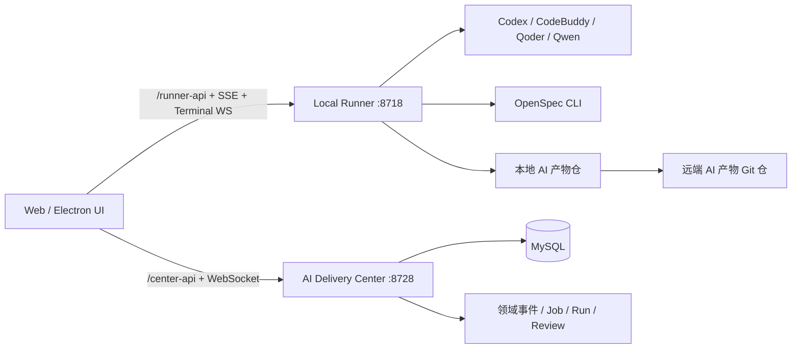
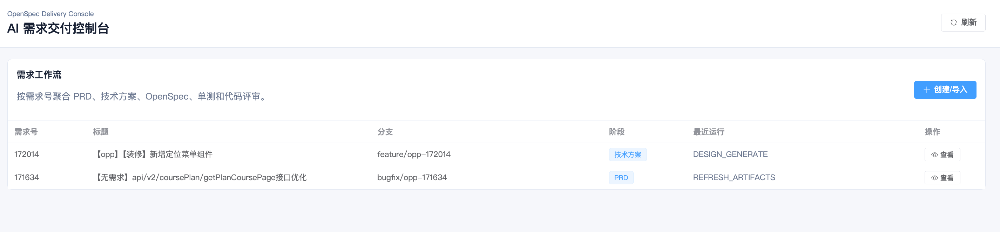
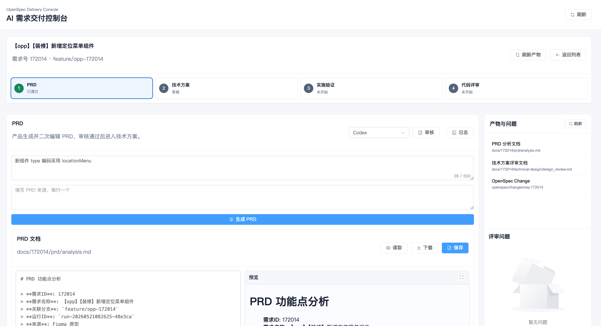
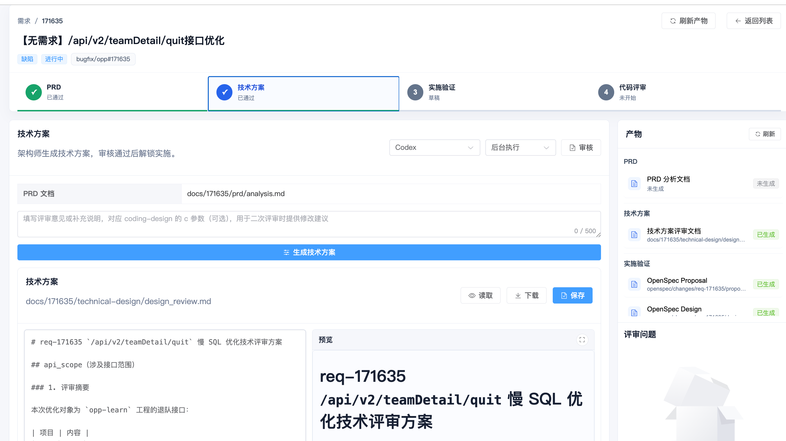
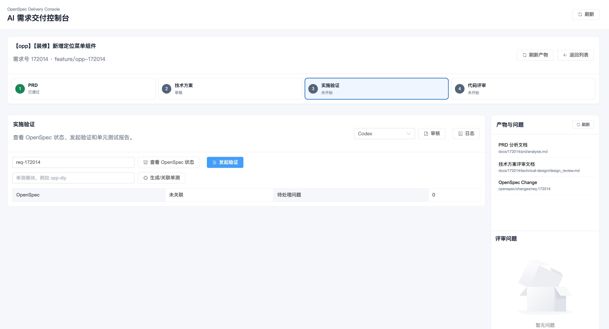
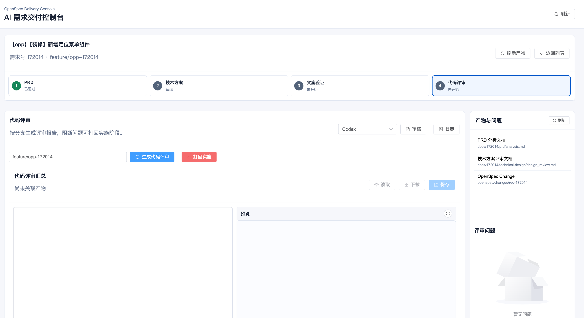
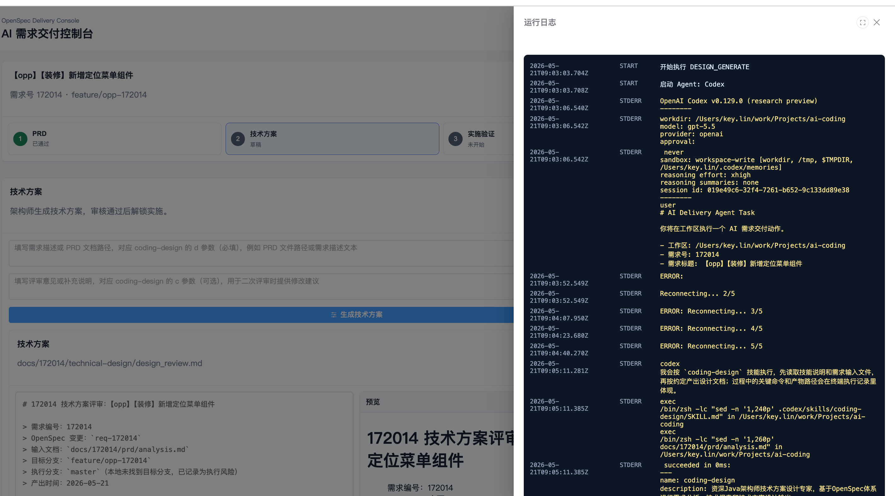

# AI 需求交付控制台

**OpenSpec + Agent Skills + Git-backed Artifacts 的可视化交付客户端**

> 当前版本：v0.1.0
> 最后更新：2026-07-21

AI 需求交付控制台是 `ai-coding` 工具链的主要入口，提供 Web 与 Electron 桌面端两种形态。它把需求、缺陷、PRD、技术方案、OpenSpec 工件、单元测试、代码评审、交付复盘、项目记忆和 Git 产物同步放到一个工作台里管理。

当前架构为 remote-only：Center 保存共享事实，Local Runner 执行本机能力，前端通过同源代理访问两者。

## 架构概览


```mermaid
flowchart LR
  Browser[Web / Electron UI] -->|/center-api + WebSocket| Center[AI Delivery Center :8728]
  Browser -->|/runner-api + SSE + Terminal WS| Runner[Local Runner :8718]
  Runner --> Agent[Codex / CodeBuddy / Qoder / Qwen]
  Runner --> OpenSpec[OpenSpec CLI]
  Runner --> LocalRepo[本地 AI 产物仓]
  Center --> Database[(MySQL)]
  Center --> Events[领域事件 / Job / Run / Review]
  LocalRepo --> RemoteRepo[远端 AI 产物 Git 仓]
```

- **前端 UI**：Vue 3 + TypeScript + Vite + Element Plus，包含 Web 页面与 Electron 桌面端。
- **Local Runner**：Node.js + tsx + 原生 HTTP 服务，负责本机 Git、OpenSpec、Agent CLI、产物扫描、技能同步和 bootstrap import。
- **AI Delivery Center**：Spring Boot 协作中心，负责登录、项目、需求、审核、issue、Job、运行事件、Git 版本索引和权限。
- **实时链路**：需求/项目事件走 Center WebSocket/STOMP；单次本地 Run 日志抽屉走 Runner EventSource/SSE；内嵌终端走 Runner WebSocket；Center Run 可通过 WebSocket run 订阅补齐。
- **Git-backed 产物仓**：新产物以 Git 仓为事实源，Center 保存版本索引，不保存 Git 私钥、本机绝对路径或 Agent token。

## 现在能做什么

### 项目与工作区

- 登录后可创建项目、加入项目、切换项目。
- 每个项目必须配置 AI 产物 Git 仓地址、平台和默认分支。
- 个人中心可配置交付工作区、项目产物仓状态、Git SSH 凭证和本机工程父目录。
- 桌面端支持系统目录选择器；网页端可手动输入本机绝对路径。
- 顶栏支持一键同步项目 Git 仓，左侧项目导航可收起。

### 需求工作流

需求类型支持 `需求` 和 `缺陷`。普通需求走 5 阶段，缺陷单跳过 PRD 阶段。

| 阶段 | 主要动作 | 关键能力 |
| --- | --- | --- |
| PRD | 生成 PRD、澄清 PRD、上传来源文件 | 支持文本、截图、PDF、Markdown 等补充输入，产物可预览和编辑 |
| 技术方案 | 生成技术方案、技术方案答疑、增量上下文消费 | 支持批注、回复、版本上下文、项目记忆召回和二次生成 |
| 实施验证 | 开始变更、工件生成与评审、开始实施、查看变更文件 | OpenSpec 子步骤、视觉上下文选择、任务勾选、Git diff 检查、单测报告 |
| 代码评审 | 正式评审、staged 暂存区预审、打回实施、归档 OpenSpec | 支持分支评审、问题追踪、外部文档约束和实施打回 |
| 交付复盘 | 生成复盘、审核复盘、确认候选经验 | 汇总沟通脉络、风险、候选经验和记忆引用反馈 |

需求列表支持按需求号/标题、需求类型、阶段、涉及工程筛选，并展示当前阶段、AI 保留度、最近运行、Token 用量、在线人数、待审数量和 Job 状态。

### 产物预览与协作评审

- Markdown 支持 HTML 预览和经典 Markdown 预览。
- 支持 Mermaid 渲染、图片路径改写、缩放、护眼模式、复制路径和 Markdown/HTML/PDF 导出。
- 长文档提供左侧目录，支持折叠、点击定位和当前章节高亮。
- 技术方案支持版本选择、版本 diff、正文选区批注、自动弹出批注菜单、右侧批注栏、回复线程和双向定位高亮。
- 产物可生成分享链接；公开分享可配置是否允许下载、是否展示批注、过期和撤销。
- 公开分享页允许匿名只读；登录用户可新增批注、回复并删除本人创建的批注/回复。

### OpenSpec 视觉上下文

在“实施验证 / 工件生成与评审”中，视觉上下文从 PRD 来源、PRD 文件和技术方案附件中扫描图片候选。

- 默认不选中任何图片。
- 用户确认勾选后才进入本次 OpenSpec 工件生成上下文。
- 选择会生成可追溯快照，避免无关截图、历史附件和临时图片污染 Agent 输入。
- 选择过多图片时会提示上下文可能被稀释，但不强制阻止。

### 项目记忆

项目记忆是交付复盘之后的经验闭环：

- 经验来源包括技术方案批注、批注回复、技术方案答疑、PRD 澄清、代码评审、记忆召回和交付复盘。
- 经验类型包括技术经验、业务规则、风险教训、团队偏好和技术假设。
- 页面提供经验库、待确认经验、召回记录、过期/废弃记录。
- 候选经验需要人工确认、修改、标记待验证、仅本需求保留或忽略。

### Agent Provider

Runner 支持多 Agent Provider：

- `codex`
- `codebuddy`
- `qoder`
- `qwen`
- 自定义 Agent Provider

当前页面执行方式主要包括：

- **内嵌终端**：默认方式。Runner 使用 PTY 启动 Agent，页面中间工作台支持 ANSI 输出、输入、resize、Ctrl-C、重连和历史只读回放。依赖 `node-pty`、`ws`、`@xterm/xterm`、`@xterm/addon-fit`。
- **外部终端**：生成 Prompt 和可执行脚本，打开本机系统终端运行 Agent。适合内嵌终端依赖不可用、Windows 首版不支持 PTY、或需要完全原生终端能力的场景。
- **手动复制**：复制标准命令和上下文，由用户在自己的 Agent 环境中执行，完成后回到页面刷新产物。

内嵌终端不可用时，页面会保留外部终端和手动复制入口；已完成的终端会话仍可在历史列表中查看 stripped 文本摘要，内嵌会话额外保存 raw ANSI transcript 用于只读回放。

Provider 命令可通过环境变量覆盖：

```bash
CODEX_COMMAND='codex exec --json --sandbox workspace-write -C {workspaceRoot} {projectParentAddDirArgs} {projectAddDirArgs} -'
CODEX_INTERACTIVE_COMMAND='codex --sandbox workspace-write -C {workspaceRoot} {projectParentAddDirArgs} {projectAddDirArgs} --no-alt-screen {prompt}'
CODEBUDDY_COMMAND='codebuddy --add-dir {workspaceRoot} {projectParentAddDirArgs} --allowedTools "Bash,Read,Write" --permission-mode bypassPermissions -p -'
QODER_COMMAND='qcode -w {workspaceRoot} -'
QWEN_COMMAND='qwen -'
```

`workspaceRoot` 是项目 AI 产物仓；`projectParentAddDirArgs` 来自个人中心配置的工程父目录；`projectAddDirArgs` 来自当前需求选择的涉及工程。

## 快速启动

### 1. 启动 Center

```bash
cd tools/ai-delivery-center
mvn spring-boot:run
```

默认地址：`http://127.0.0.1:8728`。

### 2. 启动 Local Runner

```bash
cd tools/ai-delivery-console
npm install
npm run server:dev
```

默认地址：`http://127.0.0.1:8718`。Runner 启动时会把工具链仓 `skills/coding-*` 同步到 `.codex`、`.codebuddy`、`.qoder`、`.qwen` 的技能目录。

### 3. 启动 Web UI

```bash
npm run dev
```

浏览器入口：`http://127.0.0.1:5178`。

HTTP(S) 页面不直接访问 `8718` 或 Center 域名，而是通过同源路径转发：

```text
/runner-api/* -> Local Runner
/center-api/* -> AI Delivery Center
/runner-api/* -> Runner WebSocket upgrade
/center-api/* -> Center WebSocket upgrade
```

如果将 `dist` 部署到独立 Web 服务器，该服务器必须复刻同样的代理路径契约。

### 4. 启动桌面端

```bash
npm run desktop:dev
```

开发态桌面窗口默认加载 `http://127.0.0.1:5178`。生产打包：

```bash
npm run desktop:build
```

安装包输出到 `release/`。

## 环境 Profile

控制台支持 local、dev、prd 三套 profile。

```text
.env            # 可选公共默认值
.env.local      # 本机开发，Center 默认 127.0.0.1:8728
.env.dev        # 联调环境，通常只覆盖 Center 上游
.env.prd        # 生产构建默认值
.env.example    # 变量模板
```

加载优先级：

```text
.env < .env.<profile> < shell 显式变量
```

常用脚本：

```bash
npm run dev:local
npm run dev:dev
npm run dev:prd

npm run server:dev:local
npm run server:dev:dev
npm run server:dev:prd

npm run desktop:dev:local
npm run desktop:dev:dev
npm run desktop:dev:prd

npm run build:local
npm run build:dev
npm run build:prd
```

兼容入口仍可用：`npm run dev`、`npm run server:dev`、`npm run desktop:dev` 默认走 local，`npm run build` 默认走 prd。

常用变量：

| 变量 | 说明 |
| --- | --- |
| `VITE_AI_DELIVERY_CENTER_BASE_URL` | Center 代理上游与 Electron 直连地址 |
| `VITE_AI_DELIVERY_RUNNER_BASE_URL` | Runner 代理上游与 Electron 直连地址，默认 `http://127.0.0.1:8718` |
| `VITE_AI_DELIVERY_PORT` | Runner 端口，默认 `8718` |
| `VITE_AI_DELIVERY_DEV_PORT` | Vite dev 端口，默认 `5178` |
| `VITE_AI_DELIVERY_PREVIEW_PORT` | Vite preview 端口，默认 `4178` |
| `VITE_AI_DELIVERY_ALLOWED_HOSTS` | Vite Host 白名单 |
| `AI_DELIVERY_WORKSPACE_ROOT` | Runner 使用的工具链仓根目录 |
| `AGENT_PROVIDERS_JSON` / `AGENT_PROVIDERS_PATH` | 扩展或覆盖 Agent Provider 列表 |

受控 profile 通常只声明 Center 上游地址。个人临时覆盖建议放在启动 shell 变量中，避免把本机 tunnel、token、密码、私钥或云端凭据写入仓库。

## 首次使用流程

1. 启动 Center、Runner 和 Web UI。
2. 登录或注册用户。
3. 创建项目或加入项目。
4. 创建项目时填写 AI 产物 Git 仓地址、平台和默认分支。
5. 到“个人中心 / 交付工作区”设置本机交付工作区，生成 Git SSH 凭证并把公钥配置到远端 Git 平台。
6. Clone 项目产物仓，检查仓状态。
7. 到“个人中心 / 工程目录”配置本机业务工程父目录。
8. 创建或导入需求，选择需求类型、分支名和涉及工程。
9. 按 PRD、技术方案、实施验证、代码评审、交付复盘推进。

## 产物与运行态边界

项目 AI 产物 Git 仓只保存可审阅交付物和 Agent skill 目录。

```text
docs/{需求号}/prd/analysis.md
docs/{需求号}/prd/files/**
docs/{需求号}/technical-design/design_review.md
docs/{需求号}/technical-design/questions/**
docs/{需求号}/technical-design/annotations/**
docs/{需求号}/implementation/artifact-review/inputs/**
docs/{需求号}/junit/**
docs/{需求号}/code-review/**
docs/{需求号}/metrics/ai-code-completeness.*
docs/{需求号}/retrospective/**
docs/code_review/
openspec/changes/
openspec/specs/
.codex/skills/
.codebuddy/skills/
.qoder/skills/
.qwen/skills/
```

Runner 私有运行态不进入项目 Git 仓：

```text
<deliveryWorkspaceRoot>/.ai-delivery/runtime/**
```

包括 Prompt、脚本、run event outbox、终端 transcript、raw ANSI transcript、阶段命令日志、锁文件、本地 run 状态等。历史 `docs/{需求号}/reports/run-*.log` 也会被同步和分享规则排除。

## Bootstrap 导入旧产物

旧工作区已有 `docs/{需求号}`、`openspec/changes`、`docs/code_review` 等产物时，可用 bootstrap importer 迁入 Git-backed 项目仓和 Center 索引。

```bash
npm run bootstrap:plan -- \
  --workspaceRoot /path/to/old-workspace \
  --centerBaseUrl http://127.0.0.1:8728 \
  --projectId 1 \
  --userId 1

npm run bootstrap:import -- \
  --workspaceRoot /path/to/old-workspace \
  --centerBaseUrl http://127.0.0.1:8728 \
  --projectId 1 \
  --userId 1 \
  --clientSessionId 16
```

先运行 `bootstrap:plan` 做 dry-run。正式导入必须提供 `clientSessionId`，用于定位当前客户端项目仓和 Git 同步状态。

## 界面截图

仓库保留了核心流程截图，适合做功能示意。若界面发生较大变化，可按 [截图准备指南](screenshots/README.md) 更新图片。

### 需求列表



展示需求类型、阶段、涉及工程、AI 保留度、最近运行、Token 和协作状态。

### PRD 分析



支持 PRD 来源、补充输入、文件上传、生成、澄清、预览和编辑。

### 技术方案



支持增量上下文、技术方案答疑、批注、版本和 Markdown/Mermaid 预览。

### 实施验证



围绕 OpenSpec 子步骤推进，覆盖工件生成、视觉上下文、任务勾选、单测报告和 Git 变更检查。

### 代码评审



支持正式评审、staged 暂存区预审、问题追踪、打回实施和 OpenSpec 归档。

### 运行日志



展示本次运行日志、Token 明细、搜索、级别筛选、自动滚动、全屏和复制可见日志。

## 安全边界

- Runner 只处理当前项目交付工作区和已配置工程目录内的路径。
- 页面不能传入任意终端命令，Agent Provider 必须来自默认配置、env 或显式 Provider 配置文件。
- OpenSpec 命令使用参数数组构造，避免 shell 字符串拼接注入。
- Markdown 保存使用 hash 校验，发现外部修改时阻止覆盖。
- 需求级修改动作使用锁或 Center 协作可写检查，避免同一需求并发写入。
- Git 私钥只保存在本机交付工作区，Center 只保存公钥、fingerprint、平台和状态。
- 公开分享受 token、过期、撤销、路径白名单、下载权限和批注展示权限约束。
- Center 对项目、需求、审核、issue、Job、事件订阅和 Git 版本索引做团队/项目权限校验。

## 开发与验证

```bash
cd tools/ai-delivery-console
npm run lint
npm run test:unit
npm run build
npm run test:report
```

Center 相关变更通常还需要：

```bash
cd tools/ai-delivery-center
mvn test
```

如果修改 OpenSpec 变更工件：

```bash
openspec validate <change-name> --strict
```

## 常见问题

### Q: 页面打不开或接口跨域？

确认浏览器访问的是 `http://127.0.0.1:5178`，并且 Vite 代理已经启动。HTTP(S) 页面应通过 `/runner-api/*` 和 `/center-api/*` 同源访问后端。

### Q: 看不到项目或需求？

先确认已登录、已选择项目，并且项目配置了 AI 产物 Git 仓。没有产物仓的项目会被引导到仓库必填页面。

### Q: Runner 提示项目仓未 clone 或落后远端？

到“个人中心 / 交付工作区”检查项目产物仓状态，先 Clone 或同步。落后远端时应先拉取远端变更，再继续执行或提交。

### Q: Agent 执行失败？

检查当前 Agent Provider 是否可用、命令模板是否正确、涉及工程目录是否已配置。内嵌终端依赖本机 `node-pty` 和 Runner WebSocket；不可用时切换到外部终端或手动复制。外部终端模式会生成脚本并打开本机终端，网页端目录选择器不可用时需手动输入路径。

### Q: Windows 是否支持内嵌终端？

首版以内嵌 PTY 在 macOS/Linux 可用为目标。Windows 如遇 `node-pty` 原生依赖或 PTY 行为差异，页面会提示切换到外部终端或手动复制，后续可单独补 Windows 适配。

### Q: 运行日志没有实时追加？

本地 Run 日志依赖 Runner SSE；Center Run 和需求协作事件依赖 WebSocket。先检查 Runner、Center 是否都在线，再刷新当前需求或重新打开日志抽屉。

### Q: Token 用量代表费用吗？

不代表。这里统计的是模型请求/响应 token，用于排查高消耗运行和做需求维度统计；费用仍以模型供应商或组织账单系统为准。

## 相关文档

- [主项目 README](../../README.md)
- [AI Delivery Center](../ai-delivery-center/README.md)
- [控制台核心链路时序图](../../docs/ai-delivery-console-sequence.md)
- [截图准备指南](screenshots/README.md)
- [Mermaid 支持说明](MERMAID_SUPPORT.md)
