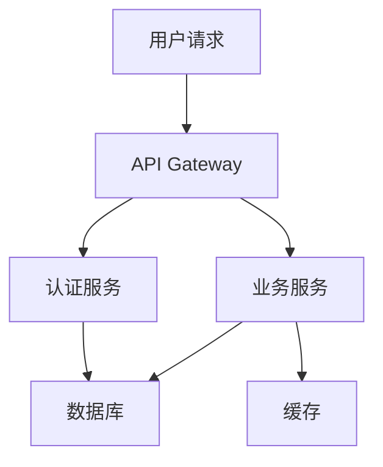

# 技术方案

测试 fixture：技术方案已生成并等待审核。

## 系统架构图

```mermaid
graph TD
    A[用户请求] --> B[API Gateway]
    B --> C[认证服务]
    B --> D[业务服务]
    C --> E[数据库]
    D --> E
    D --> F[缓存]
```

## 流程说明

这是一个测试用的流程图，用于验证 mermaid 渲染功能。
